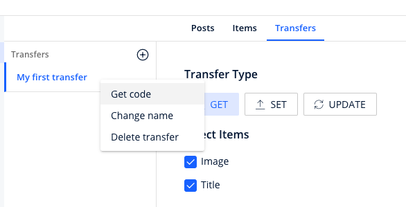

# Orbyte
## Before install
First of all, you have to download Orbyte desktop application. The app is available in

<a href="https://github.com/orbyteapp/orbyte/releases/latest" target="_blank">Github Orbyteapp</a>

<small>* Only mac version available</small>

## Usage

Install it into your project

    npm i orbyte

Once installed, you have to connect to SQL database

    const orbyte = require('orbyte')({
        host: '<your_local_host>',
        user: '<db_user>',
        password: '<your_db_pwd',
        database: '<your_db>',
        port: '<your_port>'
    });

To get, set or update data, go to the application and create new transfer. After that, right click on the transfer label and select "Get code". The code will copied.

Then you can copy the code into your project like this

    async function myFirstTransfer() {
        const response = await orbyte.connect({
            key: "94f7cc0e4ebf26ceba69edadbd82055999e91dd12aa543f6cb562039ede3a163"
        });

        console.log(response);
    };

Execute the function to view the response
